# Tools Reference

14 context-aware tools accessible from the properties panel or via keyboard shortcuts. The properties panel shows only tools relevant to the selected component type.

## Capacity Calculator

**Hotkey:** `C` | **Applies to:** Database, Cache, Message Queue, Storage, Stream Processor, Data Warehouse, CDN

Back-of-the-envelope scale estimation. Enter TPS, payload size, replication factor, read/write ratio, and retention period. Computes:

- Data volume per day/month/year
- Bandwidth requirements
- Storage projections
- DynamoDB WCU/RCU estimates

Includes a reference tab with searchable constants (byte sizes, common limits) and technology throughput/limits from the registry.

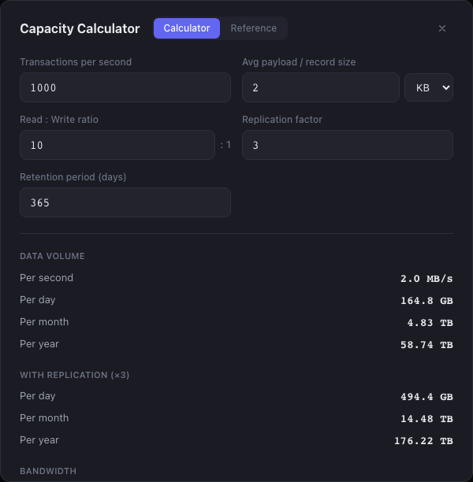

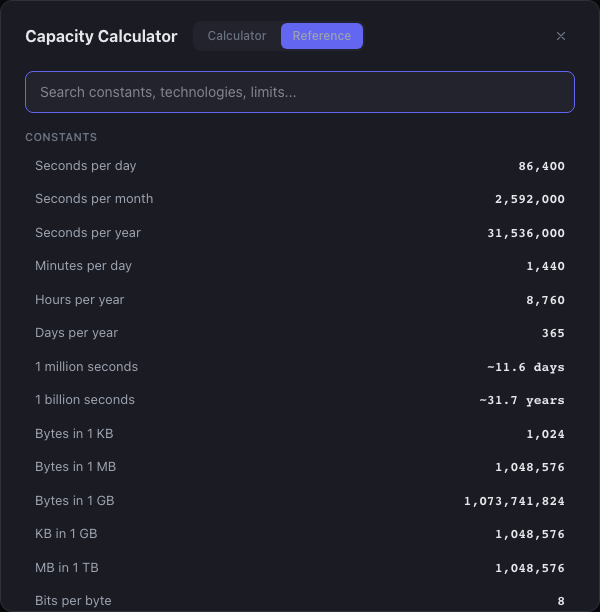

## Cron Translator

**Hotkey:** `R` | **Applies to:** Cron, Serverless

Bidirectional cron expression translator. Enter a cron expression to see the human-readable schedule, or describe a schedule in plain English to generate the cron expression. Shows next 5 fire times from a configurable start date. Switching tabs carries the result to the other side for round-trip verification.

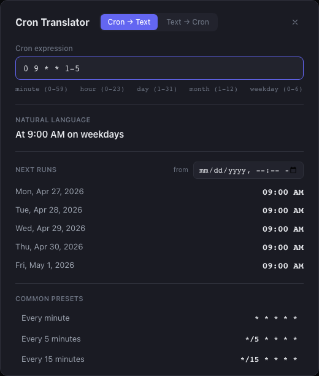

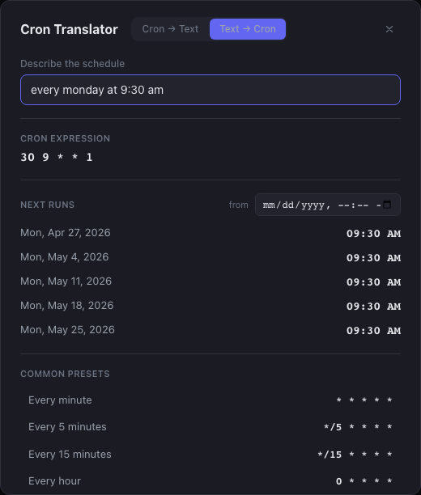

## SLA Calculator

**Applies to:** All component types

Composite SLA computation for multi-service chains. Add components with individual availability percentages and toggle between series (all must be up) and parallel (any one suffices) modes. Shows composite availability, downtime budget per month/year, error budget, and a nines count.

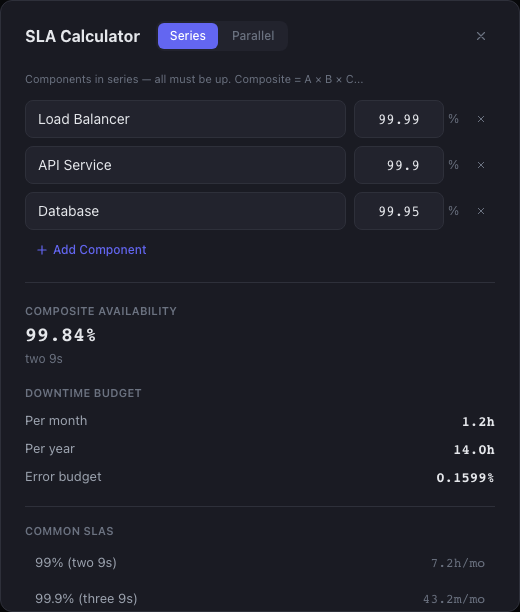

## Cache Sizer

**Applies to:** Cache

Memory and eviction estimation. Enter object count, average size, TTL, hit rate, request rate, and per-key overhead. Computes raw and overhead-adjusted memory, miss rate, origin read pressure, and eviction rate. Includes clickable reference sizes for common object types.

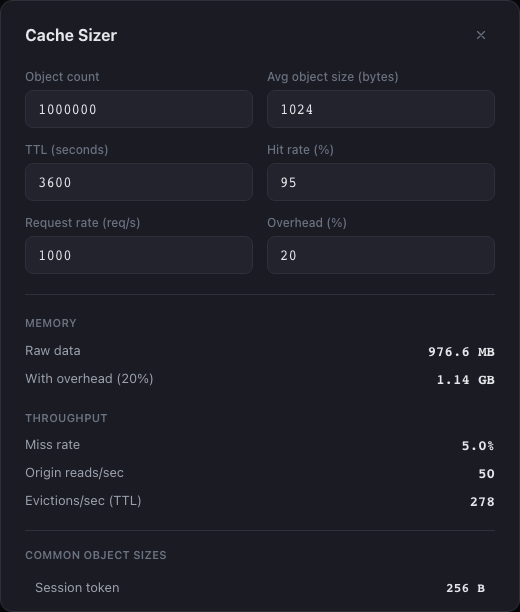

## JWT Inspector

**Applies to:** API Gateway, Firewall

Paste a JWT token to decode header, payload, and signature. Shows each claim with its registered name (iss, sub, aud, etc.), timestamps formatted as dates, and a validity indicator with time until expiry. Does not validate signatures.

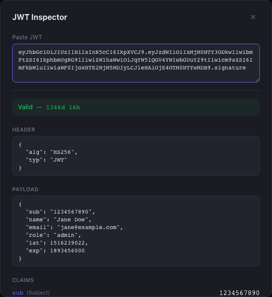

## Partition Calculator

**Applies to:** Message Queue, Stream Processor

Partition count and storage sizing. Enter producer throughput, message size, consumer count, per-consumer throughput, retention period, and replication factor. Recommends a partition count (rounded to a clean number) and shows storage per partition and total with replication.

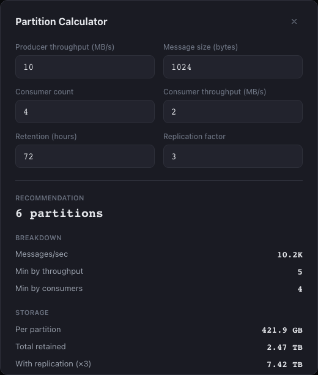

## Connection Pool Sizer

**Applies to:** Database, Cache

Pool size per instance and saturation analysis. Enter concurrent requests, average query time, service instance count, DB max connections, and safety margin. Shows connections per instance, total utilization, headroom, max QPS, and a warning when the pool exceeds the database limit. Includes clickable reference limits for common database configurations.

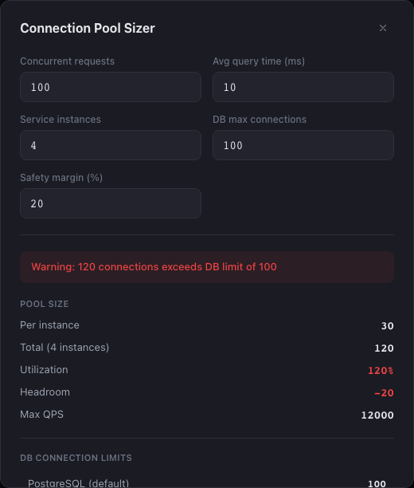

## Serverless Cost Estimator

**Applies to:** Serverless

Monthly cost projection for AWS Lambda, Google Cloud Functions, and Cloudflare Workers. Enter invocations/month, average duration, and memory allocation. Shows compute cost, request cost, total, and free tier savings breakdown. Switch between providers to compare pricing.

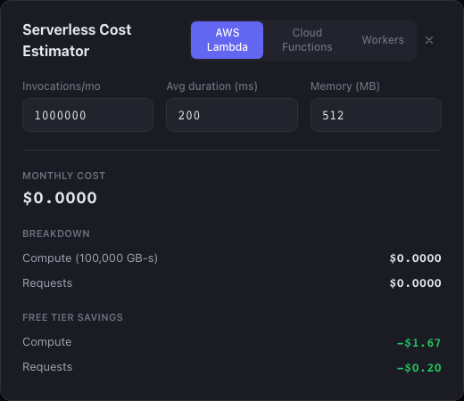

## Storage Growth Projector

**Applies to:** Storage, Data Warehouse

5-year storage capacity forecasting. Enter daily ingest rate, monthly growth percentage, retention period, compression ratio, and replication factor. Shows projected storage at 0/6/12/24/36/60 month milestones with replication, plus daily ingest rate after 1 and 3 years.

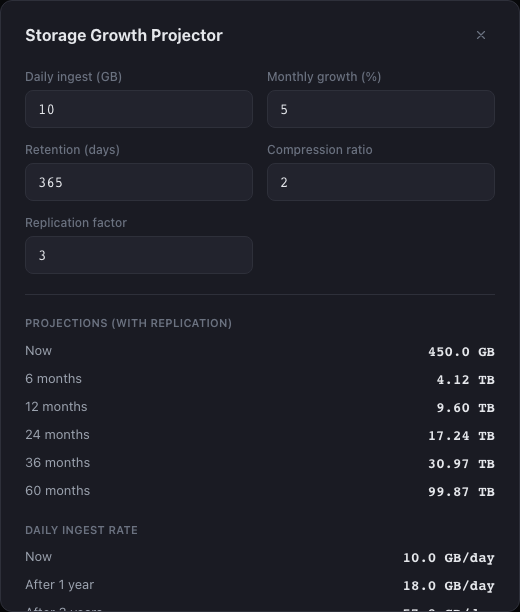

## Replication Planner

**Applies to:** Database, Cache, Message Queue

Quorum math and consistency analysis. Enter cluster node count, replication factor, and consistency level (ONE/QUORUM/ALL). Shows read/write quorum sizes, tolerated failures, whether the configuration is strongly or eventually consistent (R + W > RF), and availability computed via a binomial model.

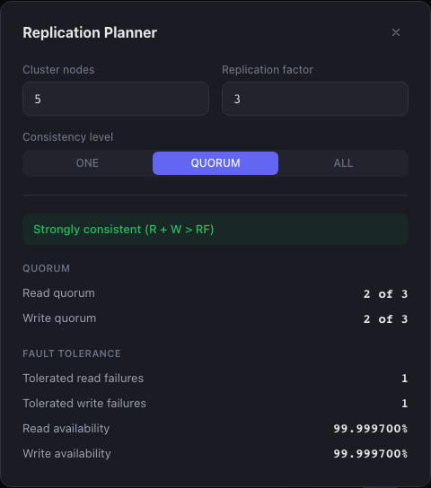

## Latency Budget Calculator

**Applies to:** API Gateway, Load Balancer, CDN

End-to-end latency budget allocation. Set a total budget in milliseconds, then add hops with p50 and p99 latencies. Shows total p50/p99, remaining budget, budget utilization percentage per hop, and a pass/fail indicator. Includes clickable reference latencies for common infrastructure components.

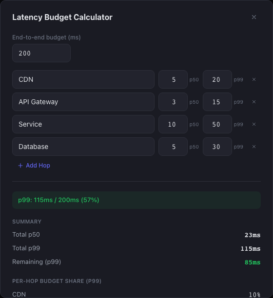

## DNS TTL Advisor

**Applies to:** DNS

TTL recommendations based on operational requirements. Select how often records change (rarely/daily/hourly/minutes) and whether fast failover is needed. Shows recommended TTL, max propagation delay, cache hit rate, and a tradeoff explanation. Includes a reference table of common TTLs with use cases.

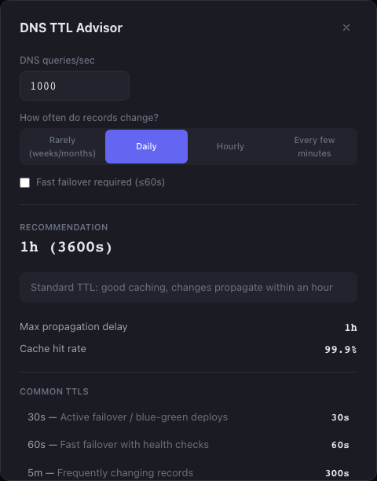

## Payload Size Estimator

**Applies to:** API Gateway, Message Queue, Webhook

Wire size comparison across serialization formats. Define fields with types (string, number, boolean, uuid, timestamp, nested) and optional length/count parameters. Compares estimated sizes for JSON, JSON+gzip, Protobuf, and MessagePack with percentage savings.

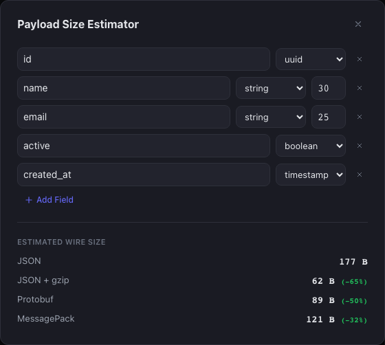

## Regex Tester

**Applies to:** API Gateway, Firewall

Live regex pattern testing with flag toggles (global, case-insensitive, multiline, dotAll). Enter a pattern and test string to see match count, matched text with index positions, and capture groups. Includes a library of common patterns (email, IPv4, UUID, URL path, ISO date, semver).

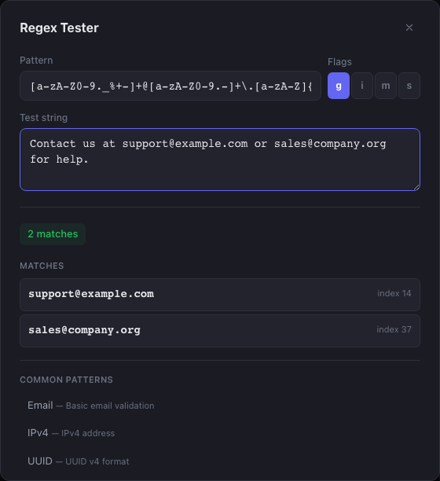
